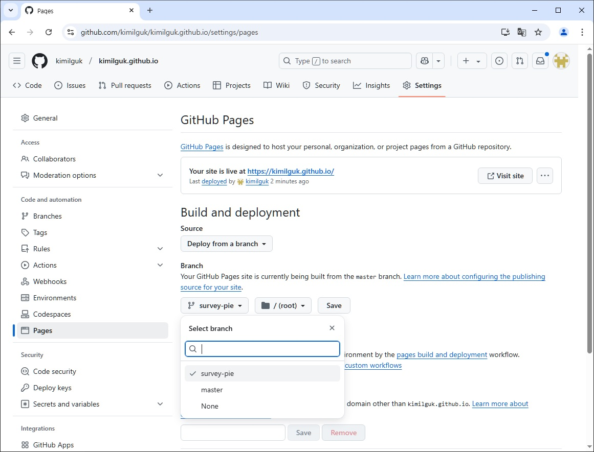

# survey-pie 앱의 관리자/사용자단 https://kimilguk.github.io/ 사이드로 이동

- 앱 소스위치 : https://github.com/kimilguk/survey-pie
  - npm run build 로 생성된 build 폴더의 모든 파일을 https://github.com/kimilguk/kimilguk.github.io 깃허브로 업로드 한다.

## 깃 허브 settings 메뉴에서 Pages 항목의 브랜치 부분을 이번에 생성한 브랜치(survey-pie)로 변경한다.(아래)

